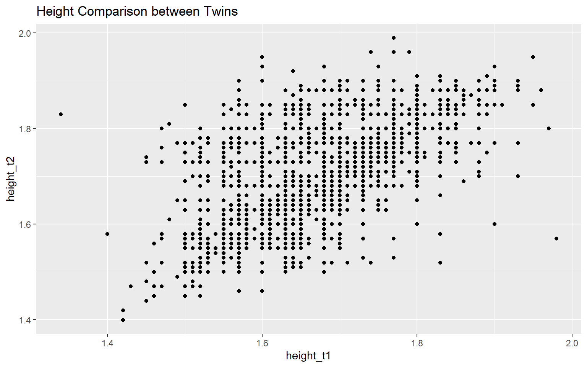
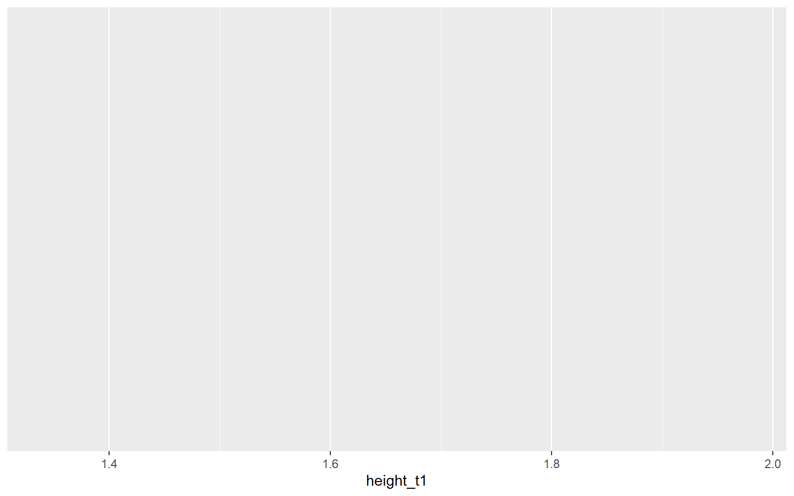
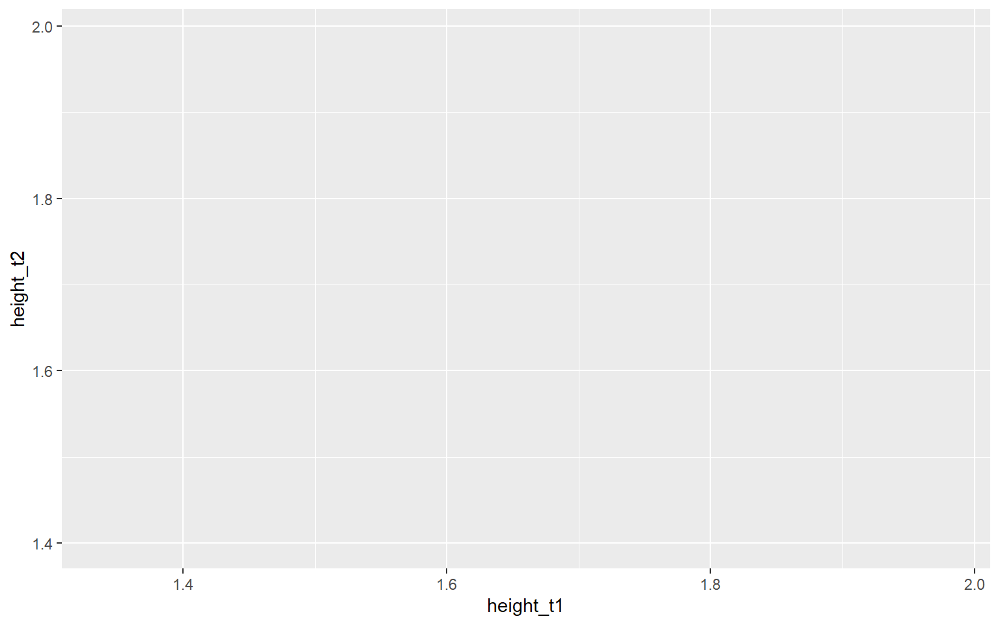
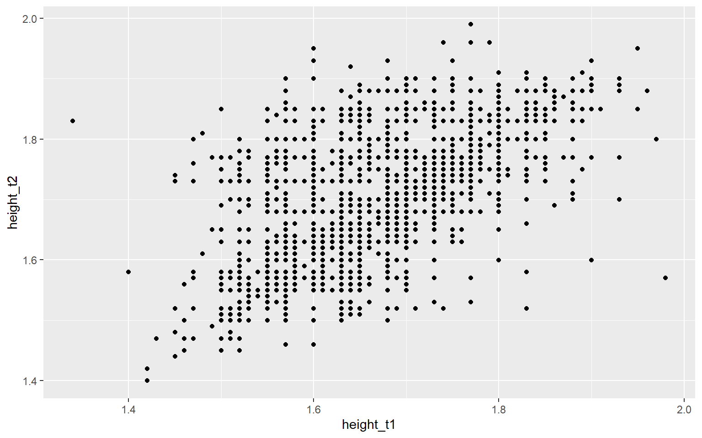
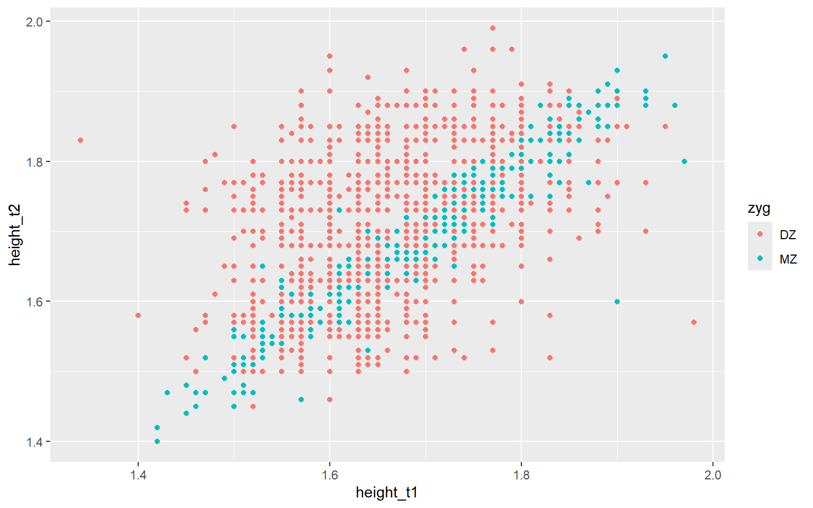
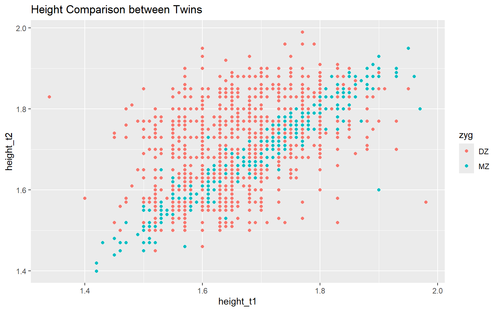
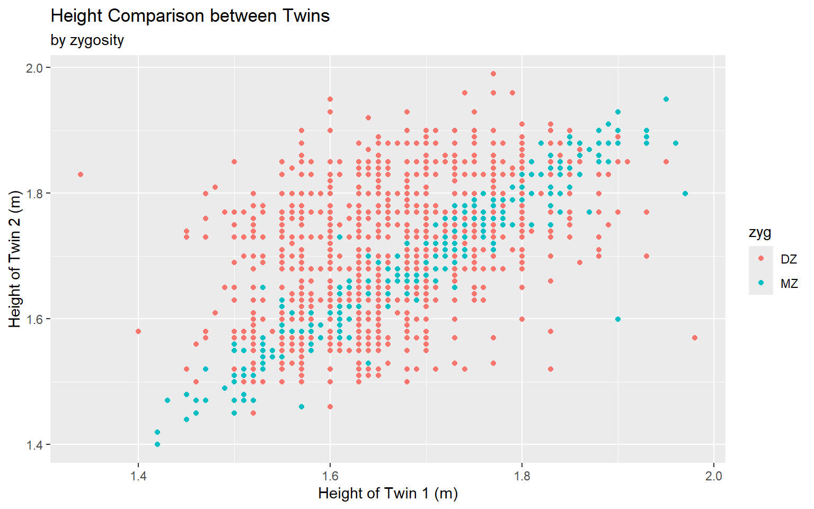
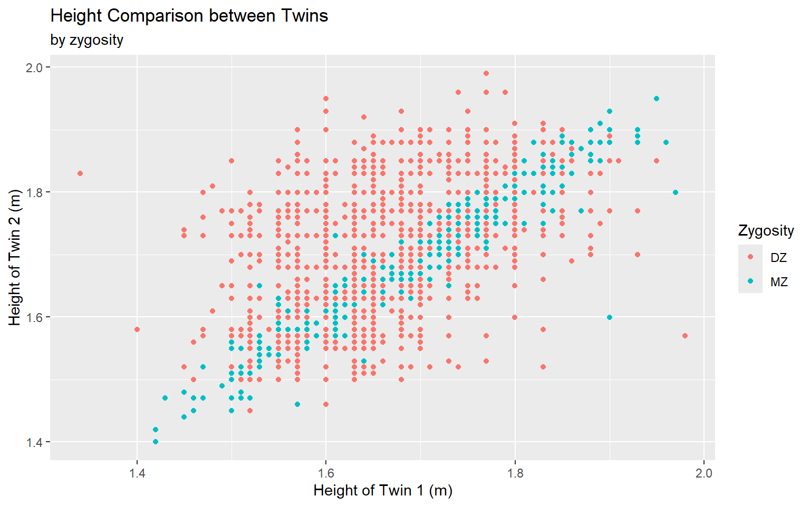
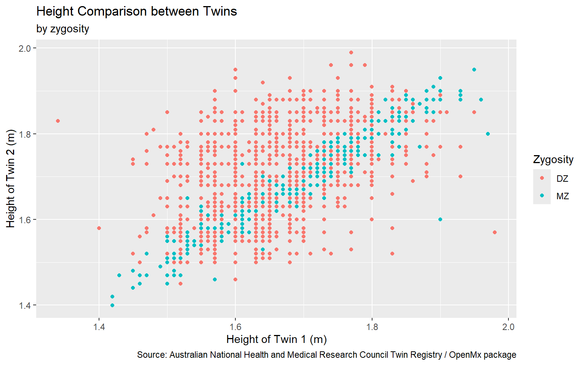
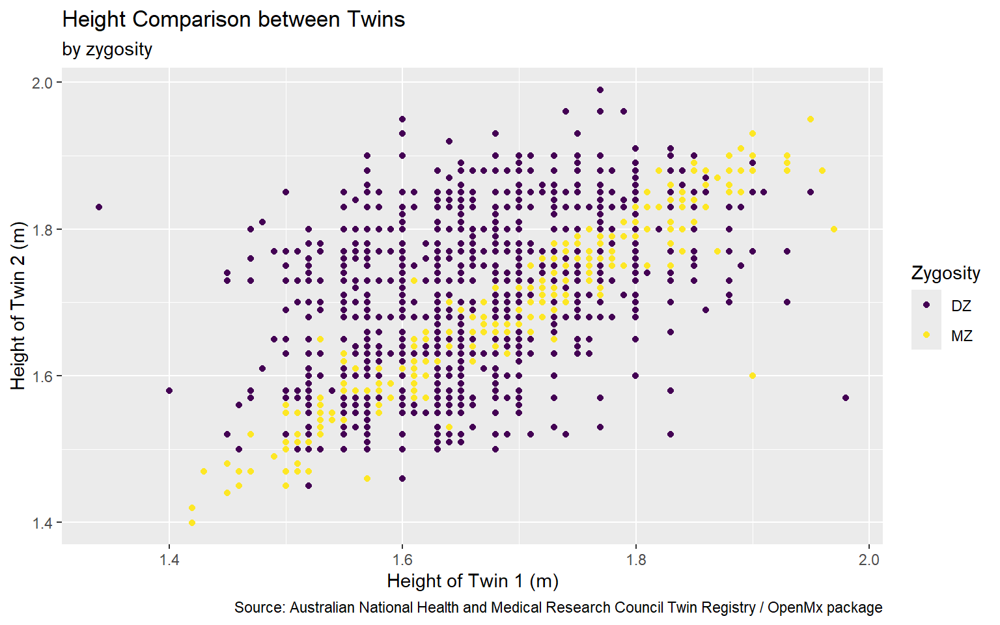

# (PART\*) Introduction {-}


# Crash Course on the Tidyverse


This chapter contains a brief introduction to the `tidyverse` package suite, which is a collection of R packages designed to make data manipulation and visualization easier and more intuitive. The `tidyverse` packages share a common philosophy and syntax, making it easy to learn and use them together. The resulting code is self-documenting, and thus easier to maintain, read, and share, making it ideal for data analysis and visualization. 

This crash course is extremely abridged. For a more in-depth treatment of the `tidyverse`, I recommend checking out my multimedia textbook [Data Science for Psychologists](https://datascience4psych.github.io/DataScience4Psych/) and the [R for Data Science](https://r4ds.had.co.nz/) book by Hadley Wickham and Garrett Grolemund.

## What is the Tidyverse?

The `tidyverse` is a collection of R packages that share a common philosophy and syntax. The packages are designed to work together to make data manipulation and visualization easier and more intuitive. The `tidyverse` includes some of the most popular and widely used R packages, such as `ggplot2`, `dplyr`, `tidyr`, and `readr`. These packages are built on the principles of tidy data, which is a standard way of organizing data that makes it easy to work with.

###  Tidy data

>Happy families are all alike; every unhappy family is unhappy in its own way. 
>
>Leo Tolstoy

Tidy data has the following properties:

1. Each variable forms a column.
2. Each observation forms a row.
3. Each type of observational unit forms a table.

Tidy data is easy to manipulate, visualize, and model, and it is the preferred format for data analysis in the `tidyverse`. The `tidyverse` packages are designed to work with tidy data, and they provide tools and functions that make it easy to transform and visualize data in this format. Untidy data does not have these properties, and it can be more difficult to work with.


## What's the Difference between Base R and the Tidyverse?

There are some key differences between base R and the `tidyverse`. I like to think of them as different dialects. (I'll often say I was raised in based R.) Base R is powerful and flexible, but it can be difficult to learn and use, especially for beginners. The `tidyverse`, on the other hand, is designed to be easy to learn and use, with a consistent syntax and a focus on data manipulation and visualization. The `tidyverse` also includes a number of functions and tools that make common data analysis tasks easier and more intuitive.

Someone who is familiar with base R might notice several key differences when they're introduced to the tidyverse. In my experience the main differences are:

- Syntax and Readability: The tidyverse uses a more consistent and readable syntax that emphasizes clarity and the flow of operations. For example, it leverages the `%>%` pipe operator from the magrittr package extensively, allowing for code to be written in a way that is easy to read from left to right, much like a series of steps.

Pipe operators are used in many programming languages to chain together operations. In R, the pipe operator `%>%` is used to pass the output of one function to the next function as the first argument. This allows you to write code in a way that is easy to read and understand, with each step of the data analysis process clearly laid out. To use the pipe operator, you simply place it between two functions, like this:

```r
output <- function1(input) %>% function2()
```


When these pipes are chained together, they create a clear and readable sequence of operations that can be easily understood by others. This makes it easier to write and maintain code, and it can also help you avoid errors by breaking down complex tasks into smaller, more manageable steps. Here's an example of how the pipe operator can be used to chain together a series of data manipulation operations in the tidyverse:

```r
data %>% 
  filter(condition) %>% 
  select(variables) %>% 
  mutate(new_variable = expression) %>% 
  group_by(grouping_variable) %>% 
  summarize(summary_statistic)
```

Much of the rest of the differences are which functions are used for common tasks. For example:
- Data Manipulation: While base R uses functions like `subset`, `merge`, and `apply`, the tidyverse offers `dplyr` which provides functions like `filter`, `select`, `mutate`, `summarize`, and `join`. These functions are often seen as more intuitive and powerful for data manipulation tasks.

- Data Import and Tidying: Base R provides functions like `read.table` and `read.csv` for data import, and various base functions for data cleaning and reshaping (e.g., `reshape`, `aggregate`). The tidyverse, on the other hand, has `readr` for reading data and `tidyr` for tidying data. The tidying functions, such as gather and spread (now evolved into `pivot_longer` and `pivot_wider`), focus on the concept of "tidy data" where each variable forms a column, each observation forms a row, and each type of observational unit forms a table.

- Handling Factor Variables: In base R, factors are often automatically created when importing data which can lead to unexpected behaviors if not properly managed. The tidyverse's `forcats` package provides tools that make factor management more explicit and less error-prone.

- Functional Programming: Base R uses apply functions like `lapply` and `sapply` for operations on lists or vectors. The tidyverse introduces `purrr` which provides a much needed enhancment for R functional programming with a consistent and coherent set of tools for working with functions and vectors.

Other differences are more subtle but can have a big impact on the user experience, such as how graphics can be handled and how data types are stored:
- Visualization: Base R uses traditional plotting functions such as plot and hist. The tidyverse offers ggplot2, based on the grammar of graphics, which allows for building plots layer by layer and integrates well with the rest of the tidyverse data manipulation packages.

- Data Types and Storage: The tidyverse introduces tibbles via the tibble package, which are modern reimaginings of data frames. Tibbles are data frames but slightly tweaked to work better in the tidyverse; for example, they never change a variable's type when adding rows, don't use row names, and provide a better print method that shows only the first 10 rows and all columns that fit on the screen.

Overall, the tidyverse provides a coherent system of packages that facilitate data manipulation, analysis, and visualization in a way that is generally considered to be more user-friendly, especially for those new to R or programming in general. However, this can also lead to a bit of a learning curve for those deeply entrenched in base R. 

## Introduction to ggplot2


In this chapter, we explore the power of `ggplot2` within the tidyverse package suite for creating compelling visual representations of twin studies in behavior genetics. `ggplot2`'s layer-oriented approach to building data visualizations allows researchers to intuitively map out the complexities inherent in twin data, providing insights that are crucial for both hypothesis testing and exploratory data analysis.

### Understanding ggplot2's Grammar of Graphics

`ggplot2`  is a powerful data visualization package in R that is part of the tidyverse suite of packages. It is based on the grammar of graphics, a coherent system for describing and building visualizations. The grammar of graphics is based on the idea that a plot can be decomposed into a set of independent components, such as data, aesthetics, and geoms (geometric objects). By combining these components, ggplot2 allows for the creation of complex and informative visualizations that can be easily customized and extended.

The structure of the code for plots can be summarized as follows:


``` r
ggplot(data = [[dataset]],
     mapping = aes(x = [[x-variable]],
                   y = [[y-variable]])) +
   geom_xxx() +
   other options
```

Each component of the plot is added in layers. The `ggplot()` function initializes the plot, `aes()` specifies the aesthetic mappings (how variables are mapped to visual properties), and `geom_xxx()` adds a geometric object (points, lines, bars, etc.) to the plot. Additional layers can be added to further customize the plot, such as labels, titles, and themes. We'll dive into these soon enough, but first, let's walk through a simple example to illustrate the basic structure of a ggplot2 plot. 


### Case Study: Visualizing Twin Data

To make this more concrete, let's consider an example using twin data on height from the `OpenMX` package, which is in the `twinData` data. These  3,808 pairs of twins are from the Australian National Health and Medical Research Council Twin Registry. The dataset contains information on the height, weight, and body mass index (BMI) of twins, along with their zygosity and other demographic information.


``` r
library(tidyverse)  # Load the tidyverse packages
library(OpenMx)    # Load the OpenMx package
library(BGmisc) # Load the BGmisc package
library(conflicted) # to handle conflicts
conflicted::conflicts_prefer(OpenMx::vech,dplyr::filter) # Resolve conflicts
```

``` r
data(twinData)
glimpse(twinData)
#> Rows: 3,808
#> Columns: 16
#> $ fam      <int> 1, 2, 3, 4, 5, 6, 7, 8, 9, 10, 11, 12, 13, 14, 15, 16, 17, 18…
#> $ age      <int> 21, 24, 21, 21, 19, 26, 23, 29, 24, 28, 29, 19, 23, 22, 23, 2…
#> $ zyg      <int> 1, 1, 1, 1, 1, 1, 1, 1, 1, 1, 1, 1, 1, 1, 1, 1, 1, 1, 1, 1, 1…
#> $ part     <int> 2, 2, 2, 2, 2, 2, 2, 2, 2, 2, 2, 2, 2, 2, 2, 2, 2, 2, 2, 2, 2…
#> $ wt1      <int> 58, 54, 55, 66, 50, 60, 65, 40, 60, 76, 48, 70, 51, 53, 58, 4…
#> $ wt2      <int> 57, 53, 50, 76, 48, 60, 65, 39, 57, 64, 51, 67, 51, 55, 57, 5…
#> $ ht1      <dbl> 1.70, 1.63, 1.65, 1.57, 1.61, 1.60, 1.75, 1.56, 1.76, 1.70, 1…
#> $ ht2      <dbl> 1.70, 1.63, 1.68, 1.65, 1.63, 1.57, 1.77, 1.53, 1.77, 1.73, 1…
#> $ htwt1    <dbl> 20.1, 20.3, 20.2, 26.8, 19.3, 23.4, 21.2, 16.4, 19.4, 26.3, 2…
#> $ htwt2    <dbl> 19.7, 19.9, 17.7, 27.9, 18.1, 24.3, 20.7, 16.7, 18.2, 21.4, 2…
#> $ bmi1     <dbl> 21.0, 21.1, 21.0, 23.0, 20.7, 22.1, 21.4, 19.6, 20.7, 22.9, 2…
#> $ bmi2     <dbl> 20.9, 21.0, 20.1, 23.3, 20.3, 22.3, 21.2, 19.7, 20.3, 21.4, 2…
#> $ cohort   <chr> "younger", "younger", "younger", "younger", "younger", "young…
#> $ zygosity <fct> MZFF, MZFF, MZFF, MZFF, MZFF, MZFF, MZFF, MZFF, MZFF, MZFF, M…
#> $ age1     <int> 21, 24, 21, 21, 19, 26, 23, 29, 24, 28, 29, 19, 23, 22, 23, 2…
#> $ age2     <int> 21, 24, 21, 21, 19, 26, 23, 29, 24, 28, 29, 19, 23, 22, 23, 2…
```

I'm going to tidy up the data a bit by renaming the columns and removing some unnecessary columns. I'll also filter out any rows with missing values in the height columns. I've also added a column to represent the sex of the twins and their zygosity.


``` r
twinData_cleaned <- twinData %>% 
  rename( # Rename columns
    family = fam,
    weight_t1 = wt1,
    weight_t2 = wt2,
    height_t1 = ht1,
    height_t2 = ht2,
    bmi_t1 = bmi1,
    bmi_t2 = bmi2,
    age_t1 = age1,
    age_t2 = age2,
    heightweight_t1 = htwt1,
    heightweight_t2 = htwt2) %>% 
  select(-c(# Remove unnecessary columns
    part,
    zyg,
    age_t1,
    age_t2)) %>% 
  filter(# Remove rows with missing values
    !is.na(height_t1),
    !is.na(height_t2)) %>%
  mutate( # Create new columns
    sex = case_when(zygosity %in% c("MZFF","DZFF") ~ "F", 
                                zygosity %in% c("MZMM","DZMM") ~ "M",
                                TRUE ~ "OS"),
                    zyg = case_when(zygosity %in% c("MZFF","MZMM") ~ "MZ", 
                                    zygosity %in% c("DZFF","DZMM","DZOS") ~ "DZ",
                                TRUE ~ NA_character_ ))

glimpse(twinData_cleaned)
#> Rows: 3,667
#> Columns: 14
#> $ family          <int> 1, 2, 3, 4, 5, 6, 7, 8, 9, 10, 11, 12, 13, 14, 15, 16,…
#> $ age             <int> 21, 24, 21, 21, 19, 26, 23, 29, 24, 28, 29, 19, 23, 22…
#> $ weight_t1       <int> 58, 54, 55, 66, 50, 60, 65, 40, 60, 76, 48, 70, 51, 53…
#> $ weight_t2       <int> 57, 53, 50, 76, 48, 60, 65, 39, 57, 64, 51, 67, 51, 55…
#> $ height_t1       <dbl> 1.70, 1.63, 1.65, 1.57, 1.61, 1.60, 1.75, 1.56, 1.76, …
#> $ height_t2       <dbl> 1.70, 1.63, 1.68, 1.65, 1.63, 1.57, 1.77, 1.53, 1.77, …
#> $ heightweight_t1 <dbl> 20.1, 20.3, 20.2, 26.8, 19.3, 23.4, 21.2, 16.4, 19.4, …
#> $ heightweight_t2 <dbl> 19.7, 19.9, 17.7, 27.9, 18.1, 24.3, 20.7, 16.7, 18.2, …
#> $ bmi_t1          <dbl> 21.0, 21.1, 21.0, 23.0, 20.7, 22.1, 21.4, 19.6, 20.7, …
#> $ bmi_t2          <dbl> 20.9, 21.0, 20.1, 23.3, 20.3, 22.3, 21.2, 19.7, 20.3, …
#> $ cohort          <chr> "younger", "younger", "younger", "younger", "younger",…
#> $ zygosity        <fct> MZFF, MZFF, MZFF, MZFF, MZFF, MZFF, MZFF, MZFF, MZFF, …
#> $ sex             <chr> "F", "F", "F", "F", "F", "F", "F", "F", "F", "F", "F",…
#> $ zyg             <chr> "MZ", "MZ", "MZ", "MZ", "MZ", "MZ", "MZ", "MZ", "MZ", …
```

The code structure for our plot would look like this:


``` r
ggplot(data = twinData_cleaned, mapping = aes(x = height_t1, 
                                              y = height_t2)) +
  geom_point() +
  labs(title = "Height Comparison between Twins")
```

It would produce a scatter plot comparing the height of twins with the height of twin 1 on the x-axis and the height of twin 2 on the y-axis.




**Start with the `twinData_cleaned` data frame**


``` r
ggplot(data = twinData_cleaned) #<<
```


Start with the `twinData_cleaned` data frame, **map twin 1's height to the x-axis**


``` r
ggplot(data = twinData_cleaned,
       mapping = aes(x = height_t1)) #<<
```




Start with the `twinData_cleaned` data frame, map twin 1's height to the x-axis, and **and map twin 2's height to the y-axis.**


``` r
ggplot(data = twinData_cleaned,
       mapping = aes( x = height_t1,
                      y = height_t2)) #<<
```



Start with the `twinData_cleaned` data frame, map twin 1's height to the x-axis, and and map twin 2's height to the y-axis. **Represent each observation with a point**


``` r
ggplot(data = twinData_cleaned,
       mapping = aes( x = height_t1,
                      y = height_t2)) + 
  geom_point() #<<
```



Start with the `twinData_cleaned` data frame, map twin 1's height to the x-axis, and and map twin 2's height to the y-axis. Represent each observation with a point, **and map zygosity to the color of each point.**


``` r
ggplot(data = twinData_cleaned,
       mapping = aes( x = height_t1,
                      y = height_t2,
                      color = zyg)) + #<<
  geom_point() 
```



Start with the `twinData_cleaned` data frame, map twin 1's height to the x-axis, and and map twin 2's height to the y-axis. Represent each observation with a point, and map zygosity to the color of each point. **Title the plot "Height Comparison between Twins"**


``` r
ggplot(data = twinData_cleaned,
       mapping = aes( x = height_t1,
                      y = height_t2,
                      color = zyg)) +
  geom_point() +
  labs(title = "Height Comparison between Twins") #<<
```



Start with the `twinData_cleaned` data frame, map twin 1's height to the x-axis, and and map twin 2's height to the y-axis. Represent each observation with a point, and map zygosity to the color of each point. Title the plot "Height Comparison between Twins", **add the subtitle "by zygosity"**


``` r
ggplot(data = twinData_cleaned,
       mapping = aes( x = height_t1,
                      y = height_t2,
                      color = zyg)) +
  geom_point() +
  labs(title = "Height Comparison between Twins",
       subtitle = "by zygosity") #<<
```


Start with the `twinData_cleaned` data frame, map twin 1's height to the x-axis, and and map twin 2's height to the y-axis. Represent each observation with a point, and map zygosity to the color of each point. Title the plot "Height Comparison between Twins", add the subtitle "by zygosity", **label the x and y axes as "Height of Twin 1 (m)" and "Height of Twin 2 (m)", respectively**


``` r
ggplot(data = twinData_cleaned,
       mapping = aes( x = height_t1,
                      y = height_t2,
                      color = zyg)) +
  geom_point() +
  labs(title = "Height Comparison between Twins",
       subtitle = "by zygosity",
       x = "Height of Twin 1 (m)", y = "Height of Twin 2 (m)") #<<
```



Start with the `twinData_cleaned` data frame, map twin 1's height to the x-axis, and and map twin 2's height to the y-axis. Represent each observation with a point, and map zygosity to the color of each point. Title the plot "Height Comparison between Twins", add the subtitle "by zygosity", label the x and y axes as "Height of Twin 1 (m)" and "Height of Twin 2 (m)", respectively , **label the legend "Zygosity"**


``` r
ggplot(data = twinData_cleaned,
       mapping = aes( x = height_t1,
                      y = height_t2,
                      color = zyg)) +
  geom_point() +
  labs(title = "Height Comparison between Twins",
       subtitle = "by zygosity",
       x = "Height of Twin 1 (m)", y = "Height of Twin 2 (m)",
       color = "Zygosity") #<<
```



Start with the `twinData_cleaned` data frame, map twin 1's height to the x-axis, and and map twin 2's height to the y-axis. Represent each observation with a point, and map zygosity to the color of each point. Title the plot "Height Comparison between Twins", add the subtitle "by zygosity", label the x and y axes as "Height of Twin 1 (m)" and "Height of Twin 2 (m)", respectively , label the legend "Zygosity", and **add a caption for the data source.**


``` r
ggplot(data = twinData_cleaned,
       mapping = aes( x = height_t1,
                      y = height_t2,
                      color = zyg)) +
  geom_point() +
  labs(title = "Height Comparison between Twins",
       subtitle = "by zygosity",
       x = "Height of Twin 1 (m)", y = "Height of Twin 2 (m)",
       color = "Zygosity",
       caption = "Source: Australian National Health and Medical Research Council Twin Registry / OpenMx package") #<<
```




Start with the `twinData_cleaned` data frame, map twin 1's height to the x-axis, and and map twin 2's height to the y-axis. Represent each observation with a point, and map zygosity to the color of each point. Title the plot "Height Comparison between Twins", add the subtitle "by zygosity", label the x and y axes as "Height of Twin 1 (m)" and "Height of Twin 2 (m)", respectively , label the legend "Zygosity", and add a caption for the data source. **Finally, use a discrete color scale that is designed to be perceived by viewers with common forms of color blindness.**


``` r
ggplot(data = twinData_cleaned,
       mapping = aes( x = height_t1,
                      y = height_t2,
                      color = zyg)) +
  geom_point() +
  labs(title = "Height Comparison between Twins",
       subtitle = "by zygosity",
       x = "Height of Twin 1 (m)", y = "Height of Twin 2 (m)",
       color = "Zygosity",
       caption = "Source: Australian National Health and Medical Research Council Twin Registry / OpenMx package") +
  scale_color_viridis_d() #<<
```


