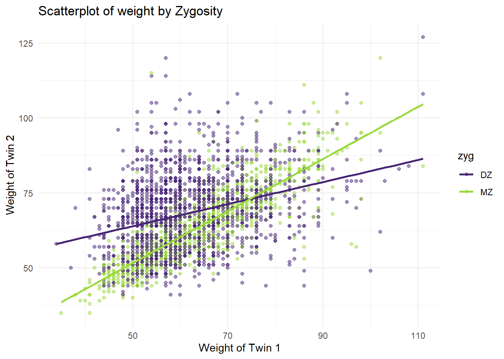
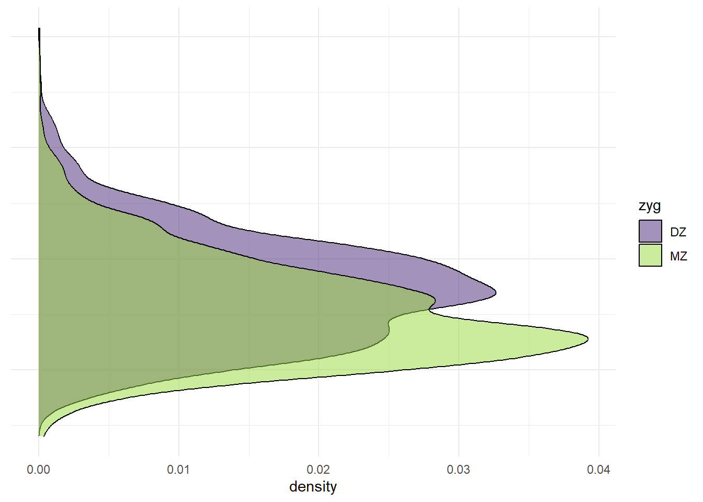

# Descriptives (Wide)

## Import Data

We're going to use the `twinData` dataset from the `OpenMx` package. This dataset contains 3,808 pairs of Australian twins on the 12 variables.


``` r
library(tidyverse)
```

```
## ── Attaching core tidyverse packages ──────────────────────── tidyverse 2.0.0 ──
## ✔ dplyr     1.1.4     ✔ readr     2.1.5
## ✔ forcats   1.0.0     ✔ stringr   1.5.1
## ✔ ggplot2   3.5.1     ✔ tibble    3.2.1
## ✔ lubridate 1.9.3     ✔ tidyr     1.3.1
## ✔ purrr     1.0.2     
## ── Conflicts ────────────────────────────────────────── tidyverse_conflicts() ──
## ✖ dplyr::filter() masks stats::filter()
## ✖ dplyr::lag()    masks stats::lag()
## ℹ Use the conflicted package (<http://conflicted.r-lib.org/>) to force all conflicts to become errors
```

``` r
library(NlsyLinks)
library(discord)
library(BGmisc)
library(OpenMx)
```

```
## 
## Attaching package: 'OpenMx'
## 
## The following object is masked from 'package:BGmisc':
## 
##     vech
```

``` r
data(twinData)

df <- twinData
```

## Data Structure


``` r
class(df)
```

```
## [1] "data.frame"
```

``` r
glimpse(df)
```

```
## Rows: 3,808
## Columns: 16
## $ fam      <int> 1, 2, 3, 4, 5, 6, 7, 8, 9, 10, 11, 12, 13, 14, 15, 16, 17, 18…
## $ age      <int> 21, 24, 21, 21, 19, 26, 23, 29, 24, 28, 29, 19, 23, 22, 23, 2…
## $ zyg      <int> 1, 1, 1, 1, 1, 1, 1, 1, 1, 1, 1, 1, 1, 1, 1, 1, 1, 1, 1, 1, 1…
## $ part     <int> 2, 2, 2, 2, 2, 2, 2, 2, 2, 2, 2, 2, 2, 2, 2, 2, 2, 2, 2, 2, 2…
## $ wt1      <int> 58, 54, 55, 66, 50, 60, 65, 40, 60, 76, 48, 70, 51, 53, 58, 4…
## $ wt2      <int> 57, 53, 50, 76, 48, 60, 65, 39, 57, 64, 51, 67, 51, 55, 57, 5…
## $ ht1      <dbl> 1.7000, 1.6299, 1.6499, 1.5698, 1.6099, 1.5999, 1.7500, 1.559…
## $ ht2      <dbl> 1.7000, 1.6299, 1.6799, 1.6499, 1.6299, 1.5698, 1.7698, 1.529…
## $ htwt1    <dbl> 20.0692, 20.3244, 20.2020, 26.7759, 19.2894, 23.4375, 21.2245…
## $ htwt2    <dbl> 19.7232, 19.9481, 17.7154, 27.9155, 18.0662, 24.3418, 20.7476…
## $ bmi1     <dbl> 20.9943, 21.0828, 21.0405, 23.0125, 20.7169, 22.0804, 21.3861…
## $ bmi2     <dbl> 20.8726, 20.9519, 20.1210, 23.3043, 20.2583, 22.3454, 21.2270…
## $ cohort   <chr> "younger", "younger", "younger", "younger", "younger", "young…
## $ zygosity <fct> MZFF, MZFF, MZFF, MZFF, MZFF, MZFF, MZFF, MZFF, MZFF, MZFF, M…
## $ age1     <int> 21, 24, 21, 21, 19, 26, 23, 29, 24, 28, 29, 19, 23, 22, 23, 2…
## $ age2     <int> 21, 24, 21, 21, 19, 26, 23, 29, 24, 28, 29, 19, 23, 22, 23, 2…
```


``` r
df <- df %>% mutate(sex = 
                      case_when(zygosity %in% c("MZFF","DZFF") ~ "F", 
                                zygosity %in% c("MZMM","DZMM") ~ "M",
                                TRUE ~ "OS"),
                    zyg = case_when(zygosity %in% c("MZFF","MZMM") ~ "MZ", 
                                    zygosity %in% c("DZFF","DZMM","DZOS") ~ "DZ",
                                TRUE ~ NA_character_ ))
```

## Summary Statistics

### Numeric Variables


``` r
# Calculate summary statistics for numeric variables across the full sample
summary_stats <- df %>%
  summarise(across(where(is.numeric), list(
    mean = ~mean(., na.rm = TRUE),
    sd = ~sd(., na.rm = TRUE),
    median = ~median(., na.rm = TRUE),
    min = ~min(., na.rm = TRUE),
    max = ~max(., na.rm = TRUE),
    IQR = ~IQR(., na.rm = TRUE)
  ), .names = "{col}_{fn}")) %>%
  pivot_longer(
    cols = everything(),
    names_to = c("variable", "statistic"),
    names_sep = "_"
  ) %>%
  pivot_wider(
    names_from = statistic,
    values_from = value
  )

summary_stats
```

```
## # A tibble: 13 × 7
##    variable    mean        sd  median   min     max      IQR
##    <chr>      <dbl>     <dbl>   <dbl> <dbl>   <dbl>    <dbl>
##  1 fam      1904.   1099.     1904.    1    3808    1904.   
##  2 age        34.5    14.2      30    17      88      19    
##  3 part        1.93    0.265     2     0       2       0    
##  4 wt1        62.2    10.9      60    34     111      15    
##  5 wt2        65.6    12.2      65    35     127      16    
##  6 ht1         1.66    0.0896    1.65  1.34    1.98    0.130
##  7 ht2         1.69    0.0990    1.7   1.40    1.99    0.140
##  8 htwt1      22.5     3.16     21.9  13.3    41.9     3.84 
##  9 htwt2      22.8     3.19     22.3  14.2    46.2     3.78 
## 10 bmi1       21.7     0.940    21.6  18.1    26.1     1.21 
## 11 bmi2       21.8     0.939    21.7  18.6    26.8     1.18 
## 12 age1       34.5    14.2      30    17      88      19    
## 13 age2       34.5    14.2      30    17      88      19
```


## Frequency Tables


``` r
# Counting 'zygosity' and calculating percentages
zygosity_summary <- df %>%
  count(zyg, name = "count") %>%
  mutate(percentage = count / sum(count) * 100) %>%
  rename(category = zyg) %>%  # Renaming the column for clarity
  mutate(variable = "zygosity")  # Adding a descriptor column for the variable

# Counting 'sex' and calculating percentages
sex_summary <- df %>%
  count(sex, name = "count") %>%
  mutate(percentage = count / sum(count) * 100) %>%
  rename(category = sex) %>%  # Renaming the column for clarity
  mutate(variable = "sex")  # Adding a descriptor column for the variable

# Combining both summaries into a single dataframe
combined_summary <- bind_rows(zygosity_summary, sex_summary) %>%
  select(variable, category, everything())  # Reordering columns for clarity

combined_summary
```

```
##   variable category count percentage
## 1 zygosity       DZ  2009   52.75735
## 2 zygosity       MZ  1799   47.24265
## 3      sex        F  1983   52.07458
## 4      sex        M   919   24.13340
## 5      sex       OS   906   23.79202
```

What if you want to examine effects by cohort? You can use the `group_by` function to group the data by cohort and then calculate the summary statistics for each cohort.


``` r
library(tidyverse)

# Grouping by 'cohort' and calculating summary statistics for each group across values that are numeric
df_summary <- df %>%
    group_by(cohort) %>%
    summarise(across(where(is.numeric), list(
        mean = ~mean(., na.rm = TRUE),
        sd = ~sd(., na.rm = TRUE),
        median = ~median(., na.rm = TRUE),
        IQR = ~IQR(., na.rm = TRUE)
    ), .names = "{.col}_{.fn}")) %>%
    # Ensure only statistic columns are being pivoted
    pivot_longer(
        cols = -cohort,  # Exclude 'cohort' from pivoting
        names_to = c("variable", "statistic"),
        names_sep = "_"
    )
# lock in the variable order
variable_order <- unique(df_summary$variable)

df_summary <- df_summary  %>% 
    pivot_wider(
        names_from = statistic,
        values_from = value,
        values_fn = list(value = mean)  # Aggregate if necessary
    )

df_summary  %>% mutate(variable = factor(variable, levels = variable_order)) %>%
    arrange(variable, cohort)
```

```
## # A tibble: 26 × 6
##    cohort  variable    mean      sd median   IQR
##    <chr>   <fct>      <dbl>   <dbl>  <dbl> <dbl>
##  1 older   fam      2859    548.      2859   949
##  2 younger fam       955    551.       955   954
##  3 older   age        45.4   12.2       42    19
##  4 younger age        23.5    3.66      23     7
##  5 older   part        1.95   0.224      2     0
##  6 younger part        1.92   0.299      2     0
##  7 older   wt1        63.8   11.2       62    15
##  8 younger wt1        60.5   10.3       59    14
##  9 older   wt2        67.0   12.7       66    19
## 10 younger wt2        64.1   11.6       64    17
## # ℹ 16 more rows
```


What about descriptives by zygosity and sex?


``` r
library(tidyverse)

# Grouping by 'zyg,sex' and calculating summary statistics for each group
df_summary <- df %>%
    group_by(zyg,sex) %>%
    summarise(across(where(is.numeric), list(
        mean = ~mean(., na.rm = TRUE),
        sd = ~sd(., na.rm = TRUE),
        median = ~median(., na.rm = TRUE),
        IQR = ~IQR(., na.rm = TRUE)
    ), .names = "{.col}_{.fn}")) %>%
    # Ensure only statistic columns are being pivoted
    pivot_longer(
        cols = -c(zyg,sex),  # Exclude 'zygosity' from pivoting
        names_to = c("variable", "statistic"),
        names_sep = "_"
    )
```

```
## `summarise()` has grouped output by 'zyg'. You can override using the `.groups`
## argument.
```

``` r
# lock in the variable order
variable_order <- unique(df_summary$variable)

df_summary <- df_summary  %>% 
    pivot_wider(
        names_from = statistic,
        values_from = value,
        values_fn = list(value = mean)  # Aggregate if necessary
    )

df_summary  %>% mutate(variable = factor(variable, levels = variable_order)) %>%
    arrange(variable,zyg,sex)
```

```
## # A tibble: 65 × 7
## # Groups:   zyg [2]
##    zyg   sex   variable   mean     sd median   IQR
##    <chr> <chr> <fct>     <dbl>  <dbl>  <dbl> <dbl>
##  1 DZ    F     fam      2109.  1029.   2891  2048 
##  2 DZ    M     fam      2144.  1009.   1370. 2042.
##  3 DZ    OS    fam      2509.   980.   1852. 1956.
##  4 MZ    F     fam      1338.   992.   1956. 1956.
##  5 MZ    M     fam      1750.  1010.   2583  2013 
##  6 DZ    F     age        35.4   14.3    32    20 
##  7 DZ    M     age        32.3   13.9    28    16 
##  8 DZ    OS    age        32.9   13.9    28    17 
##  9 MZ    F     age        35.7   14.3    32    21 
## 10 MZ    M     age        34.4   14.1    31    18 
## # ℹ 55 more rows
```

## Plots

Histograms and scatter plots to visualize distributions and relationships.


``` r
ggplot(df, aes(x = wt1)) +
  geom_histogram(bins=30, fill="blue", color="black") +
  labs(x="weight", y="Frequency", title="Distribution of weight for Twin 1") +
  theme_minimal()
```

```
## Warning: Removed 97 rows containing non-finite outside the scale range
## (`stat_bin()`).
```


``` r
# Basic Scatter Plot of weight of Twin 1 vs. weight of Twin 2
p <- ggplot(df, aes(x=wt1, y=wt2, color=zyg)) +
  geom_point(alpha=.5) +
  labs(x = "Weight of Twin 1", 
       y = "Weight of Twin 2", 
       title = "Scatterplot of weight by Zygosity") +
  scale_color_viridis_d(option = "virdis",
                        begin = 0.1,end=.85) +
  theme_minimal()

p
```

```
## Warning in viridisLite::viridis(n, alpha, begin, end, direction, option):
## Option 'virdis' does not exist. Defaulting to 'viridis'.
```

```
## Warning: Removed 173 rows containing missing values or values outside the scale range
## (`geom_point()`).
```


Adding a regression line to the scatter plot.


``` r
p + geom_smooth(method = "lm", se = FALSE)
```

```
## `geom_smooth()` using formula = 'y ~ x'
```

```
## Warning: Removed 173 rows containing non-finite outside the scale range
## (`stat_smooth()`).
```

```
## Warning in viridisLite::viridis(n, alpha, begin, end, direction, option):
## Option 'virdis' does not exist. Defaulting to 'viridis'.
```

```
## Warning: Removed 173 rows containing missing values or values outside the scale range
## (`geom_point()`).
```


``` r
library(ggplot2)
library(ggExtra)


# Create marginal density plots for x and y axes
p_x <- ggplot(df, aes(x = wt1, fill = zyg)) +
  geom_density(alpha = 0.5) +
  theme_minimal() +
  scale_fill_viridis_d(option = "viridis", begin = 0.1, end = 0.85) +
  theme(axis.title.x = element_blank(),
        axis.text.x = element_blank(),
        axis.ticks.x = element_blank())

p_x
```

```
## Warning: Removed 97 rows containing non-finite outside the scale range
## (`stat_density()`).
```



``` r
p_y <- ggplot(df, aes(x = wt2, fill = zyg)) +
  geom_density(alpha = 0.5) +
  scale_fill_viridis_d(option = "viridis", begin = 0.1, end = 0.85) +
  coord_flip() +
  theme_minimal() +
  theme(axis.title.y = element_blank(),
        axis.text.y = element_blank(),
        axis.ticks.y = element_blank())

 p_y
```

```
## Warning: Removed 86 rows containing non-finite outside the scale range
## (`stat_density()`).
```

``` r
# with marginal histogram
p1 <- ggMarginal(p, type="histogram")
```

```
## Warning in viridisLite::viridis(n, alpha, begin, end, direction, option):
## Option 'virdis' does not exist. Defaulting to 'viridis'.
```

```
## Warning in viridisLite::viridis(n, alpha, begin, end, direction, option):
## Option 'virdis' does not exist. Defaulting to 'viridis'.
```

```
## Warning: Removed 173 rows containing missing values or values outside the scale range
## (`geom_point()`).
```

```
## Warning in viridisLite::viridis(n, alpha, begin, end, direction, option):
## Option 'virdis' does not exist. Defaulting to 'viridis'.
```

```
## Warning: Removed 173 rows containing missing values or values outside the scale range
## (`geom_point()`).
```

``` r
p1
```


``` r
# marginal density
p2 <- ggMarginal(p, type="density")
```

```
## Warning in viridisLite::viridis(n, alpha, begin, end, direction, option):
## Option 'virdis' does not exist. Defaulting to 'viridis'.
## Warning in viridisLite::viridis(n, alpha, begin, end, direction, option):
## Option 'virdis' does not exist. Defaulting to 'viridis'.
```

```
## Warning: Removed 173 rows containing missing values or values outside the scale range
## (`geom_point()`).
```

```
## Warning in viridisLite::viridis(n, alpha, begin, end, direction, option):
## Option 'virdis' does not exist. Defaulting to 'viridis'.
```

```
## Warning: Removed 173 rows containing missing values or values outside the scale range
## (`geom_point()`).
```

``` r
p2
```


``` r
# marginal boxplot
p3 <- ggMarginal(p, type="boxplot")
```

```
## Warning in viridisLite::viridis(n, alpha, begin, end, direction, option):
## Option 'virdis' does not exist. Defaulting to 'viridis'.
## Warning in viridisLite::viridis(n, alpha, begin, end, direction, option):
## Option 'virdis' does not exist. Defaulting to 'viridis'.
```

```
## Warning: Removed 173 rows containing missing values or values outside the scale range
## (`geom_point()`).
```

```
## Warning in viridisLite::viridis(n, alpha, begin, end, direction, option):
## Option 'virdis' does not exist. Defaulting to 'viridis'.
```

```
## Warning: Removed 173 rows containing missing values or values outside the scale range
## (`geom_point()`).
```

``` r
p3
```




## Correlation Matrix


``` r
# Calculate the correlation matrix
```
