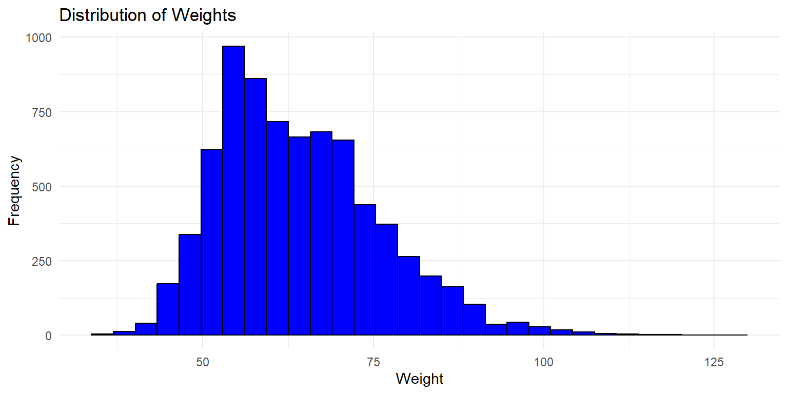
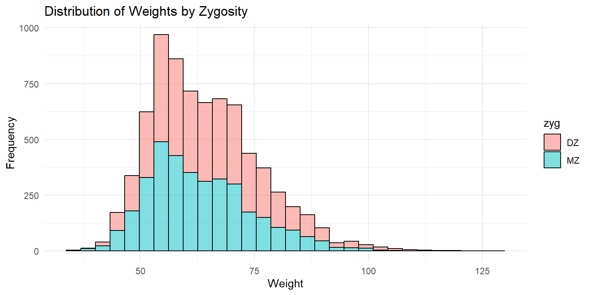
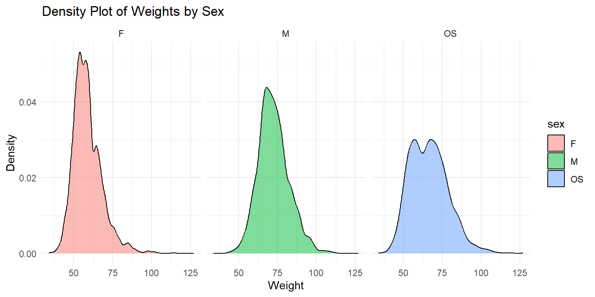
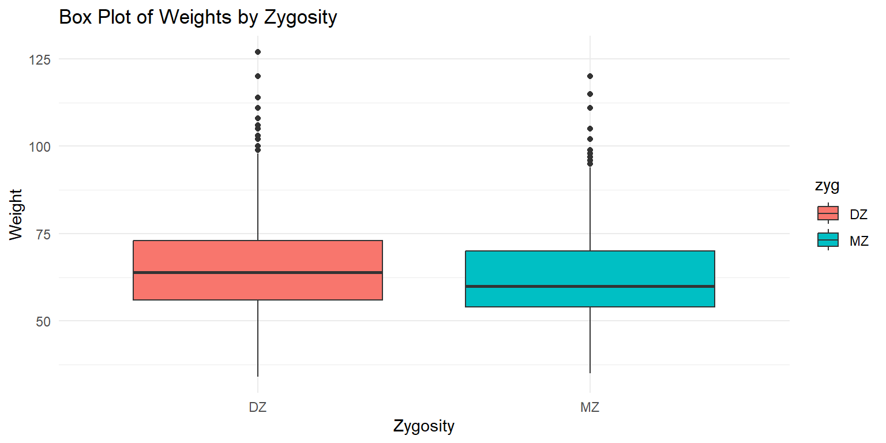
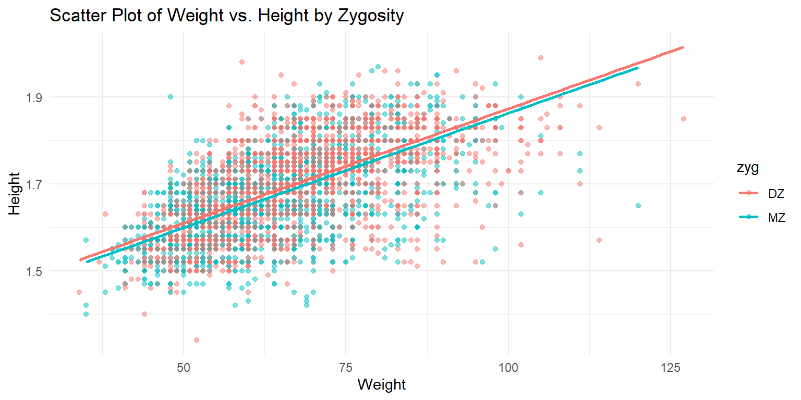

# (PART\*) Long Form Data {-}

# Long Form Data


In contrast to wide form data, long form data, also known as "tidy data," structures datasets where each row represents a single observation, and each column represents a variable. This format is highly beneficial for statistical modeling and data analysis because it simplifies the application of various data manipulation and analysis functions. As before, we'll use the `twinData` dataset from the `OpenMx` package, but we'll convert it to long form to illustrate handling and analyzing data in this format.


## Converting from Wide to Long Form


``` r
library(tidyverse)
library(NlsyLinks)
library(discord)
library(BGmisc)
library(OpenMx)
library(conflicted) # to handle conflicts
conflicted::conflicts_prefer(OpenMx::vech,dplyr::filter) # Resolve conflicts


data(twinData)

df_long <- twinData %>% select(-age)
```


``` r
# Convert wide data to long form
df_long <- df_long %>%
  pivot_longer(
    cols = matches('1$|2$'), # Select columns ending in '1' or '2'
     cols_vary = "slowest", # Specify that the columns are in the same order for each twin
    names_to = c(".value", "twin"), # Split the column names into variable and twin number
    names_pattern = "(.*)(1|2)" # Capture the variable and twin number
  )
```


## Data Structure
Let's take a look at the structure of the dataset now that it's in long form.


``` r
class(df_long)
```

```
## [1] "tbl_df"     "tbl"        "data.frame"
```

``` r
glimpse(df_long)
```

```
## Rows: 7,616
## Columns: 11
## $ fam      <int> 1, 2, 3, 4, 5, 6, 7, 8, 9, 10, 11, 12, 13, 14, 15, 16, 17, 18…
## $ zyg      <int> 1, 1, 1, 1, 1, 1, 1, 1, 1, 1, 1, 1, 1, 1, 1, 1, 1, 1, 1, 1, 1…
## $ part     <int> 2, 2, 2, 2, 2, 2, 2, 2, 2, 2, 2, 2, 2, 2, 2, 2, 2, 2, 2, 2, 2…
## $ cohort   <chr> "younger", "younger", "younger", "younger", "younger", "young…
## $ zygosity <fct> MZFF, MZFF, MZFF, MZFF, MZFF, MZFF, MZFF, MZFF, MZFF, MZFF, M…
## $ twin     <chr> "1", "1", "1", "1", "1", "1", "1", "1", "1", "1", "1", "1", "…
## $ wt       <int> 58, 54, 55, 66, 50, 60, 65, 40, 60, 76, 48, 70, 51, 53, 58, 4…
## $ ht       <dbl> 1.7000, 1.6299, 1.6499, 1.5698, 1.6099, 1.5999, 1.7500, 1.559…
## $ htwt     <dbl> 20.0692, 20.3244, 20.2020, 26.7759, 19.2894, 23.4375, 21.2245…
## $ bmi      <dbl> 20.9943, 21.0828, 21.0405, 23.0125, 20.7169, 22.0804, 21.3861…
## $ age      <int> 21, 24, 21, 21, 19, 26, 23, 29, 24, 28, 29, 19, 23, 22, 23, 2…
```

The dataset now contains a much larger number of observations, as each twin's data is represented as a separate row. The zygosity variable indicates the zygosity of the twins, while other variables are split into variable and value pairs, reflecting measurements or characteristics of the twins.

## Adding `sex` and `zyg`

To facilitate analyses that depend on sex or zygosity type, we'll add these as new columns derived from zygosity.


``` r
# Add 'sex' and 'zyg' columns based on 'zygosity'
df_long <- df_long %>%
  mutate(sex = case_when(
    zygosity %in% c("MZFF", "DZFF") ~ "F",
    zygosity %in% c("MZMM", "DZMM") ~ "M",
    TRUE ~ "OS"
  ),
  zyg = case_when(
    zygosity %in% c("MZFF", "MZMM") ~ "MZ",
    zygosity %in% c("DZFF", "DZMM", "DZOS") ~ "DZ",
    TRUE ~ NA_character_
  ))
```

Unfortunately, the data do not contain the information for the gender for each twin, so we will just have to settle for noting that the data is missing.

## Summary Statistics

Once again, let's calculate summary statistics for numeric variables across the full sample. This will provide a quick overview of central tendencies and variability in the dataset. When working with long form data, it is often helpful to start with summarizing by the data structure you already have. In this case, we will calculate summary statistics by specific measurement across all twins.


Data Structure and Summary Statistics
Examine the transformed data and calculate summary statistics similar to those performed in the wide form.


``` r
summary_stats_long <- df_long %>%
  summarise(across(where(is.numeric), list(
    mean = ~mean(., na.rm = TRUE),
    sd = ~sd(., na.rm = TRUE),
    median = ~median(., na.rm = TRUE),
    min = ~min(., na.rm = TRUE),
    max = ~max(., na.rm = TRUE),
    IQR = ~IQR(., na.rm = TRUE)
  ), .names = "{col}_{fn}")) %>%
  pivot_longer(
    cols = everything(),
    names_to = c("variable", "statistic"),
    names_sep = "_"
  ) %>%
  pivot_wider(
    names_from = statistic,
    values_from = value
  )

summary_stats_long %>% 
  print(n = 15) # to see more rows
```

```
## # A tibble: 7 × 7
##   variable    mean        sd  median   min     max      IQR
##   <chr>      <dbl>     <dbl>   <dbl> <dbl>   <dbl>    <dbl>
## 1 fam      1904.   1099.     1904.    1    3808    1904.   
## 2 part        1.93    0.265     2     0       2       0    
## 3 wt         63.9    11.7      62    34     127      16    
## 4 ht          1.68    0.0958    1.68  1.34    1.99    0.150
## 5 htwt       22.6     3.18     22.2  13.3    46.2     3.83 
## 6 bmi        21.8     0.941    21.7  18.1    26.8     1.20 
## 7 age        34.5    14.2      30    17      88      19
```


Generate frequency tables for sex and zyg, paralleling the wide form analysis.
# Frequency Tables

Paralleling the wide form analysis, let us create frequency tables for categorical variables like zygosity and sex. These tables should provide a clear picture of the distribution of these categories within the dataset. In some ways, these calculations are simpler in long form data because each row is already an individual observation. 


``` r
# Counting 'zygosity' and calculating percentages
zygosity_summary_long <- df_long %>%
  count(zyg, name = "count") %>%
  mutate(percentage = count / sum(count) * 100) %>%
  rename(category = zyg) %>%  # Renaming the column for clarity
  mutate(variable = "zygosity")  # Adding a descriptor column for the variable

# Counting 'sex' and calculating percentages
sex_summary_long <- df_long %>%
  count(sex, name = "count") %>%
  mutate(percentage = count / sum(count) * 100) %>%
  rename(category = sex) %>%  # Renaming the column for clarity
  mutate(variable = "sex")  # Adding a descriptor column for the variable

# Combining both summaries into a single dataframe
combined_summary_long <- bind_rows(zygosity_summary_long, sex_summary_long) %>%
  select(variable, category, everything())  # Reordering columns for clarity

combined_summary_long
```

```
## # A tibble: 5 × 4
##   variable category count percentage
##   <chr>    <chr>    <int>      <dbl>
## 1 zygosity DZ        4018       52.8
## 2 zygosity MZ        3598       47.2
## 3 sex      F         3966       52.1
## 4 sex      M         1838       24.1
## 5 sex      OS        1812       23.8
```

As you can see, the long form data structure allows for a straightforward calculation of frequency tables for categorical variables. The resulting tables provide a clear picture of the distribution, and it does not differ  from the wide form analysis, as long as one remembers to that we're now looking at individual twins rather than pairs.

## Data Visualization

### 1. Univariate Distributions

Univariate distributions are used to examine the distribution of a single variable within a dataset. They provide insights into the central tendency, variability, and shape of the data distribution. Unlike wide form data, long form data can be directly visualized using ggplot2 without the need for additional data manipulation.

#### Histograms

Histograms are useful for visualizing the frequency distribution of a single variable. They help identify the distribution pattern, such as normal distribution, skewness, or the presence of outliers.

**Histogram of Weight**


``` r
ggplot(df_long, aes(x = wt)) +
  geom_histogram(bins = 30, fill = "blue", color = "black") +
  labs(x = "Weight", y = "Frequency", title = "Distribution of Weights") +
  theme_minimal()
```



This histogram shows the distribution of weights across all twins in the dataset. The x-axis represents the weight, while the y-axis shows the frequency of each weight range.

#### Histograms

Histograms are useful for visualizing the frequency distribution of a single variable. They help identify the distribution pattern, such as normal distribution, skewness, or the presence of outliers.

**Histogram of Weight**


``` r
ggplot(df_long, aes(x = wt)) +
  geom_histogram(bins = 30, fill = "blue", color = "black") +
  labs(x = "Weight", y = "Frequency", title = "Distribution of Weights") +
  theme_minimal()
```


This histogram shows the distribution of weights across all twins in the dataset. The x-axis represents the weight, while the y-axis shows the frequency of each weight range.

**Histogram of Weight by Zygosity**


``` r
ggplot(df_long, aes(x = wt, fill = zyg)) +
  geom_histogram(bins = 30, color = "black", alpha = 0.5) +
  labs(x = "Weight", y = "Frequency", title = "Distribution of Weights by Zygosity") +
  theme_minimal()
```



This histogram shows the distribution of weights by zygosity type. The fill color distinguishes between monozygotic (MZ) and dizygotic (DZ) twins. The x-axis represents the weight, while the y-axis shows the frequency of each weight range. The transparency helps in visualizing the overlap between the two distributions.

### Density Plots

Density plots provide a smooth representation of the distribution of a variable. They are useful for comparing distributions between groups.

**Density Plot of Weights by Zygosity**


``` r
ggplot(df_long, aes(x = wt, fill = zyg)) +
  geom_density(alpha = 0.5) +
  labs(x = "Weight", y = "Density", title = "Density Plot of Weights by Zygosity") +
  theme_minimal()
```


This density plot shows the distribution of weights by zygosity type. The fill color distinguishes between monozygotic (MZ) and dizygotic (DZ) twins. The x-axis represents the weight, while the y-axis shows the density of each weight range. The plot provides a smooth representation of the distribution, highlighting the differences between the two zygosity groups.


**Density Plot of Weights by Sex**


``` r
ggplot(df_long, aes(x = wt, fill = sex)) +
  geom_density(alpha = 0.5) +
  labs(x = "Weight", y = "Density", title = "Density Plot of Weights by Sex") +
  theme_minimal() + 
  facet_wrap(~sex)
```



This density plot shows the weight distributions for male (M) and female (F) twins and OS twins. The plot is faceted by sex to provide a clear comparison between the groups groups.

#### 2. Box Plots

Box plots are useful for visualizing the distribution of a variable and identifying potential outliers. They display the median, quartiles, and extremes of the data.

**Box Plot of Weights by Zygosity**


``` r
ggplot(df_long, aes(x = zyg, y = wt, fill = zyg)) +
  geom_boxplot() +
  labs(x = "Zygosity", y = "Weight", title = "Box Plot of Weights by Zygosity") +
  theme_minimal()
```



This box plot shows the distribution of weights by zygosity type. The x-axis represents the zygosity (monozygotic or dizygotic), while the y-axis shows the weight range. The plot displays the median, quartiles, and potential outliers for each zygosity group.


**Violin Plot of Heights by Zygosity**


``` r
ggplot(df_long, aes(x = zyg, y = ht, fill = zyg)) +
  geom_violin() +
  labs(x = "Zygosity", y = "Height", title = "Violin Plot of Heights by Zygosity") +
  theme_minimal()
```


This violin plot shows the distribution of heights by zygosity type. The x-axis represents the zygosity (monozygotic or dizygotic), while the y-axis shows the height range. The plot provides a smooth representation of the distribution, highlighting the differences between the two zygosity groups.

### 2. Bivariate Distributions

Bivariate distributions are used to examine the relationship between two variables. They help in understanding the correlation and interaction between the variables.

#### Scatter Plots

Scatter plots are useful for visualizing the relationship between two continuous variables. They help identify patterns, trends, and potential outliers in the data.

**Scatter Plot of Height vs. Weight**


``` r
ggplot(df_long, aes(x = wt, y = ht, color = zyg)) +
  geom_point(alpha = 0.5) +
  labs(x = "Weight", y = "Height", title = "Scatter Plot of Weight vs. Height by Zygosity") +
  theme_minimal() +
  geom_smooth(method = "lm", se = FALSE)
```

```
## `geom_smooth()` using formula = 'y ~ x'
```



This scatter plot shows the relationship between weight and height, with points colored by zygosity. A linear regression line is added to highlight the trend in the data. The x-axis represents the weight, while the y-axis shows the height. The plot helps in understanding the correlation between weight and height, as well as the differences between monozygotic and dizygotic twins.

### 4. Marginal Density Plots

Marginal density plots are useful for adding distribution information to scatter plots, providing additional context on the variables' distributions.

**Marginal Density Plot of Height vs. Weight**


``` r
library(ggExtra)

p <- ggplot(df_long, aes(x = wt, y = ht, color = zyg)) +
  geom_point(alpha = 0.5) +
  labs(x = "Weight", y = "Height", title = "Scatter Plot of Weight vs. Height by Zygosity") +
  theme_minimal()

ggMarginal(p, type = "density")
```


This plot shows a scatter plot of weight vs. height with marginal density plots on the x and y axes, providing additional distribution information.

### 5. Correlations

Correlation matrices and correlograms are useful for visualizing the relationships between multiple variables. They show the strength and direction of correlations between variables.

** Correlation Matrix of Twin Data **


``` r
library(ggcorrplot)

# Select only the variables of interest
df_cor_long <- df_long %>% select(wt, ht)

# Compute correlation matrix
corr_long <- cor(df_cor_long ,use="pairwise.complete") %>% round(2)

ggcorrplot(corr_long, type = "lower", lab = TRUE, 
           lab_size = 3, 
           method = "circle", 
           colors = c("tomato2", "white", "springgreen3"), 
           title = "Correlation Matrix of Twin Data", 
           ggtheme = theme_bw)
```


This correlation matrix shows the relationships between weight and height. The values indicate the strength and direction of the correlations, with the color representing the correlation strength. 

**Correlation Matrix by Zygosity**


``` r
corr_zyg_long <- df_long %>%
  group_by(zyg) %>%
  summarise(
    cor_wt_ht = cor(wt, ht, use = "pairwise.complete")
  ) %>%
  pivot_longer(-zyg, names_to = "pairs", values_to = "correlation") %>%
  unite("pairs", pairs, zyg, sep = "_") %>%
  pivot_wider(names_from = pairs, values_from = correlation)

combined_matrix_long <- matrix(1, nrow = 2, ncol = 2)
rownames(combined_matrix_long) <- colnames(combined_matrix_long) <- c("wt", "ht")

# Fill the lower triangle with MZ correlations
combined_matrix_long[lower.tri(combined_matrix_long)] <- c(corr_zyg_long$cor_wt_ht_MZ)

# Fill the upper triangle with DZ correlations
combined_matrix_long[upper.tri(combined_matrix_long)] <- c(corr_zyg_long$cor_wt_ht_DZ)

ggcorrplot(combined_matrix_long, show.diag = TRUE, lab = TRUE, 
           lab_size = 3, method = "circle", 
           colors = c("tomato2", "white", "springgreen3"), 
           title = "Correlation Matrix of Twin Data by Zygosity",
           ggtheme = theme_bw) + 
  labs(caption = "MZ correlations in the lower triangle,\nDZ correlations in the upper triangle")
```


This plot shows a correlation matrix separated by zygosity. MZ correlations are displayed in the lower triangle, and DZ correlations are in the upper triangle, allowing for a comparison of correlation strengths between the two groups.
