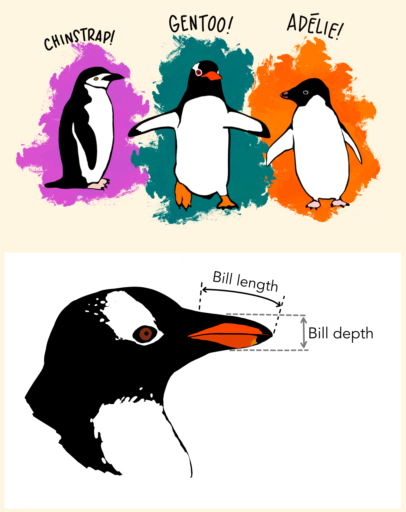

```{r child = "../setup.Rmd"}
```

```{r packages, echo=FALSE, message=FALSE, warning=FALSE}
library(tidyverse)
library(palmerpenguins)
conflicts_prefer(palmerpenguins::penguins)
# Remember to compile
#xaringan::inf_mr(cast_from = "..")
```

class: middle

# ggplot2 `r emo::ji("heart")` `r emo::ji("penguin")`

---

## ggplot2 $\in$ tidyverse

.pull-left-narrow[
```{r echo=FALSE}
knitr::include_graphics("img/ggplot2-part-of-tidyverse.png")
```
] 

<!-- markdownlint-disable error -->
.pull-right-wide[ 
- **ggplot2** is tidyverse's data visualization package 
- Structure of the code for plots can be summarized as

```{r eval = FALSE}
ggplot(data = [[dataset]],
     mapping = aes(x = [[x-variable]],
                   y = [[y-variable]])) +
   geom_xxx() +
   other options
```
]
<!-- markdownlint-enable -->

---

## Data: Palmer Penguins

Measurements for penguin species, island in Palmer Archipelago, size (flipper length, body mass, bill dimensions), and sex.


.pull-left[
```{r echo=FALSE, out.width="80%"}

```
]

---

## Data: Palmer Penguins

Measurements for penguin species, island in Palmer Archipelago, size (flipper length, body mass, bill dimensions), and sex.


```{r}
library(palmerpenguins)
glimpse(penguins)
```


---

# Plot

```{r ref.label = "penguins", echo = FALSE, warning = FALSE, out.width = "70%", fig.width = 8}
```


---

# Code

```{r penguins, fig.show = "hide", out.width="80%"}
ggplot(data = penguins,
       mapping = aes(x = bill_depth_mm, y = bill_length_mm,
                     color = species)) +
  geom_point() +
  labs(title = "Bill depth and length",
       subtitle = "Dimensions for Adelie, Chinstrap, and Gentoo Penguins",
       x = "Bill depth (mm)", y = "Bill length (mm)",
       color = "Species")
```

---
class: middle

# Wrapping Up...

---
class: middle

# Coding out loud

---

```{r,warning=FALSE, include=FALSE, messages=FALSE}
library(tidyverse)  # Load the tidyverse packages
library(OpenMx)    # Load the OpenMx package
library(BGmisc) # Load the BGmisc package
library(conflicted) # to handle conflicts
conflicted::conflicts_prefer(OpenMx::vech,dplyr::filter) # Resolve conflicts
data(twinData)
twinData_cleaned <- twinData %>% 
  rename( # Rename columns
    family = fam,
    weight_t1 = wt1,
    weight_t2 = wt2,
    height_t1 = ht1,
    height_t2 = ht2,
    bmi_t1 = bmi1,
    bmi_t2 = bmi2,
    age_t1 = age1,
    age_t2 = age2,
    heightweight_t1 = htwt1,
    heightweight_t2 = htwt2) %>% 
  select(-c(# Remove unnecessary columns
    part,
    zyg,
    age_t1,
    age_t2)) %>% 
  filter(# Remove rows with missing values
    !is.na(height_t1),
    !is.na(height_t2)) %>%
  mutate( # Create new columns
    sex = case_when(zygosity %in% c("MZFF","DZFF") ~ "F", 
                                zygosity %in% c("MZMM","DZMM") ~ "M",
                                TRUE ~ "OS"),
                    zyg = case_when(zygosity %in% c("MZFF","MZMM") ~ "MZ", 
                                    zygosity %in% c("DZFF","DZMM","DZOS") ~ "DZ",
                                TRUE ~ NA_character_ ))

```

.midi[
> **Start with the `twinData_cleaned` data frame**
]

.pull-left[
```{r twin-0, fig.show="hide", warning=FALSE}
ggplot(data = twinData_cleaned) #<<
```
]
.pull-right[
```{r ref.label = "twin-0", echo = FALSE, warning = FALSE, out.width = "100%", fig.width = 8}
```
]

---

.midi[
> Start with the `twinData_cleaned` data frame,
> **map height of Twin 1 to the x-axis**
]

.pull-left[
```{r twin-1, fig.show = "hide", warning = FALSE}
ggplot(data = twinData_cleaned,
       mapping = aes(x = height_t1)) #<<
```
]
.pull-right[
```{r ref.label = "twin-1", echo = FALSE, warning = FALSE, out.width = "100%", fig.width = 8}
```
]

---

.midi[
> Start with the `twinData_cleaned` data frame,
> map height of Twin 1 to the x-axis
> **and map height of Twin 2 to the y-axis.**
]

.pull-left[
```{r twin-2, fig.show = "hide", warning = FALSE}
ggplot(data = twinData_cleaned,
       mapping = aes(x = height_t1, 
                     y = height_t2)) #<<
```
]
.pull-right[
```{r ref.label = "twin-2", echo = FALSE, warning = FALSE, out.width = "100%", fig.width 8}
```
]

---

.midi[
> Start with the `twinData_cleaned` data frame,
> map height of Twin 1 to the x-axis
> and map height of Twin 2 to the y-axis. 
> **Represent each observation with a point**
]

.pull-left[
```{r twin-3, fig.show = "hide", warning = FALSE}
ggplot(data = twinData_cleaned,
       mapping = aes(x = height_t1, 
                     y = height_t2)) + 
  geom_point() #<<
```
]
.pull-right[
```{r ref.label = "twin-3", echo = FALSE, warning = FALSE, out.width = "100%", fig.width 8}
```
]

---

.midi[
> Start with the `twinData_cleaned` data frame,
> map height of Twin 1 to the x-axis
> and map height of Twin 2 to the y-axis. 
> Represent each observation with a point
> **and map zygosity to the color of each point.**
]

.pull-left[
```{r twin-4, fig.show = "hide", warning = FALSE}
ggplot(data = twinData_cleaned,
       mapping = aes( x = height_t1,
                      y = height_t2,
                      color = zyg)) + #<<
  geom_point() 
```
]
.pull-right[
```{r ref.label = "twin-4", echo = FALSE, warning = FALSE, out.width = "100%", fig.width 8}
```
]

---

.midi[
> Start with the `penguins` data frame,
> map bill depth to the x-axis
> and map bill length to the y-axis. 
> Represent each observation with a point
> and map species to the color of each point.
> **Title the plot "Bill depth and length"**
]

.pull-left[
```{r penguins-5, fig.show = "hide", warning = FALSE}
ggplot(data = penguins,
       mapping = aes(x = bill_depth_mm,
                     y = bill_length_mm,
                     color = species)) +
  geom_point() +
  labs(title = "Bill depth and length") #<<
```
]
.pull-right[
```{r ref.label = "penguins-5", echo = FALSE, warning = FALSE, out.width = "100%", fig.width = 8}
```
]

---

.midi[
> Start with the `penguins` data frame,
> map bill depth to the x-axis
> and map bill length to the y-axis. 
> Represent each observation with a point
> and map species to the color of each point.
> Title the plot "Bill depth and length", 
> **add the subtitle "Dimensions for Adelie, Chinstrap, and Gentoo Penguins"**
]

.pull-left[
```{r penguins-6, fig.show = "hide", warning = FALSE}
ggplot(data = penguins,
       mapping = aes(x = bill_depth_mm,
                     y = bill_length_mm,
                     color = species)) +
  geom_point() +
  labs(title = "Bill depth and length",
       subtitle = "Dimensions for Adelie, Chinstrap, and Gentoo Penguins") #<<
```
]
.pull-right[
```{r ref.label = "penguins-6", echo = FALSE, warning = FALSE, out.width = "100%", fig.width = 8}
```
]

---

.midi[
> Start with the `penguins` data frame,
> map bill depth to the x-axis
> and map bill length to the y-axis. 
> Represent each observation with a point
> and map species to the color of each point.
> Title the plot "Bill depth and length", 
> add the subtitle "Dimensions for Adelie, Chinstrap, and Gentoo Penguins", 
> **label the x and y axes as "Bill depth (mm)" and "Bill length (mm)", respectively**
]

.pull-left[
```{r penguins-7, fig.show = "hide", warning = FALSE}
ggplot(data = penguins,
       mapping = aes(x = bill_depth_mm,
                     y = bill_length_mm,
                     color = species)) +
  geom_point() +
  labs(title = "Bill depth and length",
       subtitle = "Dimensions for Adelie, Chinstrap, and Gentoo Penguins",
       x = "Bill depth (mm)", y = "Bill length (mm)") #<<
```
]
.pull-right[
```{r ref.label = "penguins-7", echo = FALSE, warning = FALSE, out.width = "100%", fig.width = 8}
```
]

---

.midi[
> Start with the `penguins` data frame,
> map bill depth to the x-axis
> and map bill length to the y-axis. 
> Represent each observation with a point
> and map species to the color of each point.
> Title the plot "Bill depth and length", 
> add the subtitle "Dimensions for Adelie, Chinstrap, and Gentoo Penguins", 
> label the x and y axes as "Bill depth (mm)" and "Bill length (mm)", respectively,
> **label the legend "Species"**
]

.pull-left[
```{r penguins-8, fig.show = "hide", warning = FALSE}
ggplot(data = penguins,
       mapping = aes(x = bill_depth_mm,
                     y = bill_length_mm,
                     color = species)) +
  geom_point() +
  labs(title = "Bill depth and length",
       subtitle = "Dimensions for Adelie, Chinstrap, and Gentoo Penguins",
       x = "Bill depth (mm)", y = "Bill length (mm)",
       color = "Species") #<<
```
]
.pull-right[
```{r ref.label = "penguins-8", echo = FALSE, warning = FALSE, out.width = "100%", fig.width = 8}
```
]

---

.midi[
> Start with the `penguins` data frame,
> map bill depth to the x-axis
> and map bill length to the y-axis. 
> Represent each observation with a point
> and map species to the color of each point.
> Title the plot "Bill depth and length", 
> add the subtitle "Dimensions for Adelie, Chinstrap, and Gentoo Penguins", 
> label the x and y axes as "Bill depth (mm)" and "Bill length (mm)", respectively,
> label the legend "Species", 
> **and add a caption for the data source.**
]
 
.pull-left[
```{r penguins-9, fig.show = "hide", warning = FALSE}
ggplot(data = penguins,
       mapping = aes(x = bill_depth_mm,
                     y = bill_length_mm,
                     color = species)) +
  geom_point() +
  labs(title = "Bill depth and length",
       subtitle = "Dimensions for Adelie, Chinstrap, and Gentoo Penguins",
       x = "Bill depth (mm)", y = "Bill length (mm)",
       color = "Species",
       caption = "Source: Palmer Station LTER / palmerpenguins package") #<<
```
]
.pull-right[
```{r ref.label = "penguins-9", echo = FALSE, warning = FALSE, out.width = "100%", fig.width = 8}
```
]

---

.midi[
> Start with the `penguins` data frame,
> map bill depth to the x-axis
> and map bill length to the y-axis. 
> Represent each observation with a point
> and map species to the color of each point.
> Title the plot "Bill depth and length", 
> add the subtitle "Dimensions for Adelie, Chinstrap, and Gentoo Penguins", 
> label the x and y axes as "Bill depth (mm)" and "Bill length (mm)", respectively,
> label the legend "Species", 
> and add a caption for the data source.
> **Finally, use a discrete color scale that is designed to be perceived by viewers with common forms of color blindness.**
]

.pull-left[
```{r penguins-10, fig.show = "hide", warning = FALSE}
ggplot(data = penguins,
       mapping = aes(x = bill_depth_mm,
                     y = bill_length_mm,
                     color = species)) +
  geom_point() +
  labs(title = "Bill depth and length",
       subtitle = "Dimensions for Adelie, Chinstrap, and Gentoo Penguins",
       x = "Bill depth (mm)", y = "Bill length (mm)",
       color = "Species",
       caption = "Source: Palmer Station LTER / palmerpenguins package") +
  scale_color_viridis_d() #<<
```
]
.pull-right[
```{r ref.label = "penguins-10", echo = FALSE, warning = FALSE, out.width = "100%", fig.width = 8}
```
]

---

# Plot

```{r ref.label="penguins-10-nohighlight", echo = FALSE, warning = FALSE, out.width = "70%", fig.width = 8}
```

---

# Code

```{r penguins-10-nohighlight, fig.show = "hide"}
ggplot(data = penguins,
       mapping = aes(x = bill_depth_mm,
                     y = bill_length_mm,
                     color = species)) +
  geom_point() +
  labs(title = "Bill depth and length",
       subtitle = "Dimensions for Adelie, Chinstrap, and Gentoo Penguins",
       x = "Bill depth (mm)", y = "Bill length (mm)",
       color = "Species",
       caption = "Source: Palmer Station LTER / palmerpenguins package") +
  scale_color_viridis_d()
```

---

# Narrative

.midi[
+ Start with the `penguins` data frame,
map bill depth to the x-axis
and map bill length to the y-axis. 
+ Represent each observation with a point
and map species to the color of each point.
+ Title the plot "Bill depth and length", 
add the subtitle "Dimensions for Adelie, Chinstrap, and Gentoo Penguins", 
label the x and y axes as "Bill depth (mm)" and "Bill length (mm)", respectively,
label the legend "Species", 
and add a caption for the data source.
+ Finally, use a discrete color scale that is designed to be perceived by viewers with common forms of color blindness.
]

---

## Argument names

.tip[
You can omit the names of first two arguments when building plots with `ggplot()`.
]

.pull-left[
```{r named-args, eval = FALSE}
ggplot(data = penguins,
       mapping = aes(x = bill_depth_mm,
                     y = bill_length_mm,
                     color = species)) +
  geom_point() +
  scale_color_viridis_d()
```
]
.pull-right[
```{r not-named-args, eval = FALSE}
ggplot(penguins,
       aes(x = bill_depth_mm,
           y = bill_length_mm,
           color = species)) +
  geom_point() +
  scale_color_viridis_d()
```
]

---

class: middle

# Wrapping Up...

---

class: middle

# Aesthetics

---

## Aesthetics options

Commonly used characteristics of plotting characters that can be **mapped to a specific variable** in the data are

- `color`
- `shape`
- `size`
- `alpha` (transparency)

---

## Color

.pull-left[
```{r color, fig.show = "hide", warning = FALSE}
ggplot(penguins,
       aes(x = bill_depth_mm, 
           y = bill_length_mm,
           color = species)) + #<<
  geom_point() +
  scale_color_viridis_d()
```
]
.pull-right[
```{r ref.label = "color", echo = FALSE, warning = FALSE, out.width = "100%"}
```
]

---

## Shape

Mapped to a different variable than `color`

.pull-left[
```{r shape-island, fig.show = "hide", warning = FALSE}
ggplot(penguins,
       aes(x = bill_depth_mm, 
           y = bill_length_mm,
           color = species,
           shape = island)) + #<<
  geom_point() +
  scale_color_viridis_d()
```
]
.pull-right[
```{r ref.label = "shape-island", echo = FALSE, warning = FALSE, out.width = "100%"}
```
]

---

## Shape

Mapped to same variable as `color`

.pull-left[
```{r shape-species, fig.show = "hide", warning = FALSE}
ggplot(penguins,
       aes(x = bill_depth_mm, 
           y = bill_length_mm,
           color = species,
           shape = species)) + #<<
  geom_point() +
  scale_color_viridis_d()
```
]
.pull-right[
```{r ref.label = "shape-species", echo = FALSE, warning = FALSE, out.width = "100%"}
```
]

---

## Size

.pull-left[
```{r size, fig.show = "hide", warning = FALSE}
ggplot(penguins,
       aes(x = bill_depth_mm, 
           y = bill_length_mm,
           color = species,
           shape = species,
           size = body_mass_g)) + #<<
  geom_point() +
  scale_color_viridis_d()
```
]
.pull-right[
```{r ref.label = "size", echo = FALSE, warning = FALSE, out.width = "100%"}
```
]

---

## Alpha

.pull-left[
```{r alpha, fig.show = "hide", warning = FALSE}
ggplot(penguins,
       aes(x = bill_depth_mm, 
           y = bill_length_mm,
           color = species,
           shape = species,
           size = body_mass_g,
           alpha = flipper_length_mm)) + #<<
  geom_point() +
  scale_color_viridis_d()
```
]
.pull-right[
```{r ref.label = "alpha", echo = FALSE, warning = FALSE, out.width = "100%"}
```
]

---

.pull-left[
**Mapping**

```{r warning = FALSE, out.width = "100%"}
ggplot(penguins,
       aes(x = bill_depth_mm,
           y = bill_length_mm,
           size = body_mass_g, #<<
           alpha = flipper_length_mm)) + #<<
  geom_point()
```
]
.pull-right[
**Setting**

```{r warning = FALSE, out.width = "100%"}
ggplot(penguins,
       aes(x = bill_depth_mm,
           y = bill_length_mm)) + 
  geom_point(size = 2, alpha = 0.5) #<<
```
]

---

## Mapping vs. setting

- **Mapping:** Determine the size, alpha, etc. of points based on the values of a variable in the data
  - goes into `aes()`
- **Setting:** Determine the size, alpha, etc. of points **not** based on the values of a variable in the data
  - goes into `geom_*()` 
     - (in the previous example, we used `geom_point()` , 
         - but we'll learn about other geoms soon!)
  
---

class: middle

# Faceting

---

## Faceting

- Smaller plots that display different subsets of the data
- Useful for exploring conditional relationships and large data

---

### Plot
```{r ref.label = "facet", echo = FALSE, warning = FALSE, out.width = "70%"}
```

---

### Code

```{r facet, fig.show = "hide"}
ggplot(penguins, aes(x = bill_depth_mm, y = bill_length_mm)) + 
  geom_point() +
  facet_grid(species ~ island) #<<
```

---

## Various ways to facet


In the next few slides describe what each plot displays. Think about how the code relates to the output.

.question[
**Note:** The plots in the next few slides do not have proper titles, axis labels, etc. because we want you to figure out what's happening in the plots.
But you should always label your plots!
]

---

```{r warning = FALSE}
ggplot(penguins, aes(x = bill_depth_mm, y = bill_length_mm)) + 
  geom_point() +
  facet_grid(species ~ sex) #<<
```

---

```{r warning = FALSE}
ggplot(penguins, aes(x = bill_depth_mm, y = bill_length_mm)) + 
  geom_point() +
  facet_grid(sex ~ species) #<<
```

---

```{r warning = FALSE, fig.asp = 0.5}
ggplot(penguins, aes(x = bill_depth_mm, y = bill_length_mm)) + 
  geom_point() +
  facet_wrap(~ species) #<<
```

---

```{r warning = FALSE, fig.asp = 0.5}
ggplot(penguins, aes(x = bill_depth_mm, y = bill_length_mm)) + 
  geom_point() +
  facet_grid(. ~ species) #<<
```

---

```{r warning = FALSE}
ggplot(penguins, aes(x = bill_depth_mm, y = bill_length_mm)) + 
  geom_point() +
  facet_wrap(~ species, ncol = 2) #<<
```

---

## Faceting summary

- `facet_grid()`:
    - 2d grid
    - `rows ~ cols`
    - use `.` for no split
- `facet_wrap()`: 1d ribbon wrapped according to number of rows and columns specified or available plotting area

---

## Facet and color

.pull-left-narrow[
```{r facet-color-legend, fig.show = "hide", warning = FALSE}
ggplot(
  penguins, 
  aes(x = bill_depth_mm, 
      y = bill_length_mm, 
      color = species)) + #<<
  geom_point() +
  facet_grid(species ~ sex) +
  scale_color_viridis_d() #<<
```
]
.pull-right-wide[
```{r ref.label = "facet-color-legend", echo = FALSE, warning = FALSE, out.width = "100%"}
```
]

---

## Facet and color, no legend

.pull-left-narrow[
```{r facet-color-no-legend, fig.show = "hide", warning = FALSE}
ggplot(
  penguins, 
  aes(x = bill_depth_mm, 
      y = bill_length_mm, 
      color = species)) +
  geom_point() +
  facet_grid(species ~ sex) +
  scale_color_viridis_d() +
  guides(color = FALSE) #<<
```
]
.pull-right-wide[
```{r ref.label = "facet-color-no-legend", echo = FALSE, warning = FALSE, out.width = "100%"}
```
]

---

class: middle

# Wrapping Up...
